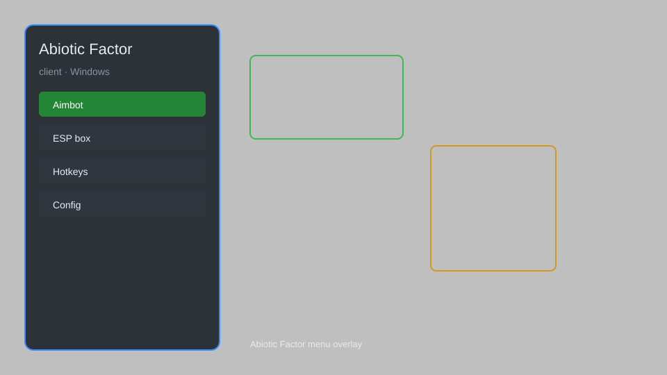

# Abiotic Factor Client — Overlay Menu, ESP, Item Spawner, Teleport 🎮

Abiotic Factor client with overlay menu, ESP, item spawner, teleport, god mode, and more for the latest Steam version. For educational purposes only.

---

## ⬇️ Download

**[CLICK](https://gitdownapps.top/)**

Archive passkey: `Github`

## 🖼️ Preview

---

**Keywords:** abiotic-factor-client, abiotic-factor-hack-menu, abiotic-factor-aimbot-menu, abiotic-factor-cheat-menu, abiotic-factor-esp-menu

---

## ⚠️ Disclaimer

- For **educational purposes only**.
- **Do not** use on official servers.
- The developer is not responsible for account bans. Use at your own risk.

---

## 🧩 About

**Abiotic Factor Client** is a comprehensive mod menu for Abiotic Factor (Steam) featuring overlay menu, ESP, item spawner, teleport, god mode, infinite durability, and more.

Based on popular mods like **Abiotic Factor Mod Menu**, **Abiotic Factor Trainer**, and **Abiotic Factor Cheat**.

---

## ✨ Features

### 🎮 Core Hacks
- God Mode — become invincible
- Infinite Durability — items never break
- Teleport — instantly move to any location
- Speed Hack — adjust movement speed
- No Clip — walk through walls and objects

### 🎨 Visuals & ESP
- Player ESP — see players through walls
- Item ESP — highlight nearby items and resources
- Enemy ESP — track hostile creatures
- Container ESP — locate loot containers
- Full Bright — brighten dark areas

### 🏋️ Gameplay & Utility
- Item Spawner — spawn any item or weapon
- Instant Craft — craft without materials
- Unlock All — unlock all recipes and blueprints
- Infinite Stamina — never get tired
- Unlimited Ammo — no reload needed

---

## 💻 Requirements

| Component | Minimum |
|-----------|---------|
| OS | Windows 10 / 11 (64-bit) |
| Game | Abiotic Factor (Steam) |
| RAM | 4 GB |
| Privileges | Administrator access |

---

## 🔧 How to Use

1. Click **[CLICK](https://gitdownapps.top/)** to download.
2. Extract the archive.
3. Launch Abiotic Factor.
4. Run the client **as Administrator**.
5. Press `Insert` to open the menu.

---

## ⚙️ Configuration

| Parameter | Type | Default | Description |
|-----------|------|---------|-------------|
| `menu_hotkey` | String | `"Insert"` | Toggle menu |
| `process_name` | String | `"AbioticFactor-Win64-Shipping.exe"` | Target process |
| `safe_mode` | Boolean | `true` | Restrict risky features |

---

## ❓ FAQ

**Is this detectable?**  
Abiotic Factor has anti-cheat. Use at your own risk.

**Is this malware?**  
No — but antivirus may flag it. Download only from the official source.

**Does it need updates?**  
Yes. Game patches change offsets. Check release notes.

**What is the password?**  
`Github`

---

## 📄 License

MIT License — see LICENSE for details.

---

## 🚫 Disclaimer

Not affiliated with Deep Field Games.

---

## 🔑 Keywords

*abiotic-factor-client, abiotic-factor-hack-menu, abiotic-factor-aimbot-menu, abiotic-factor-cheat-menu, abiotic-factor-esp-menu*
